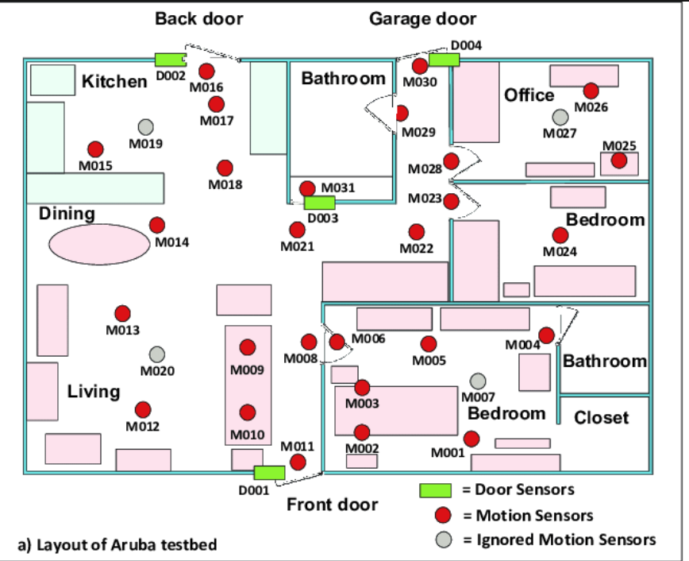
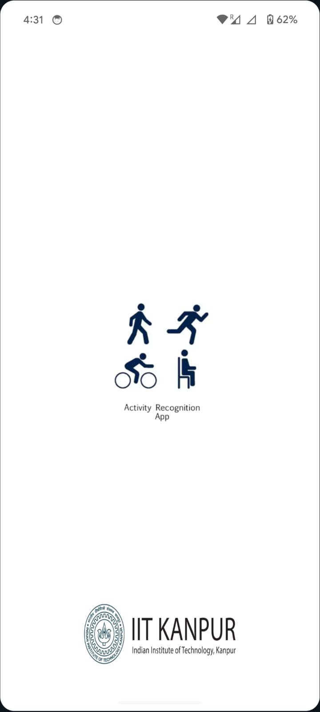
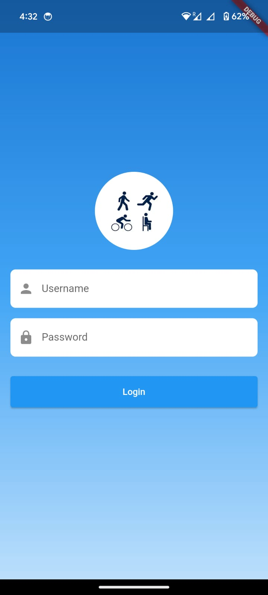
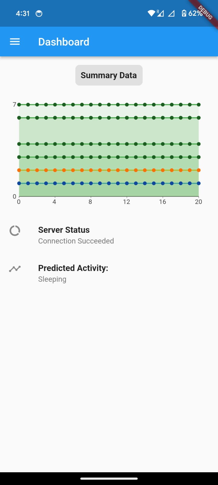
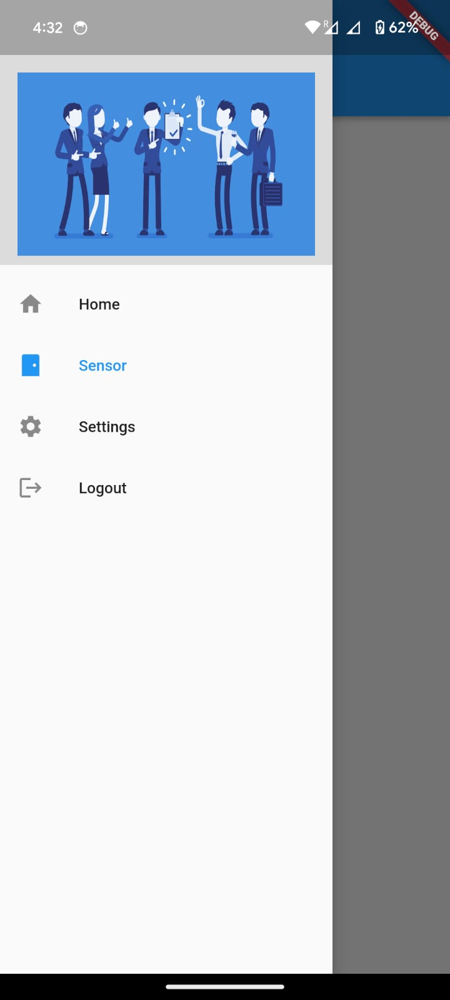
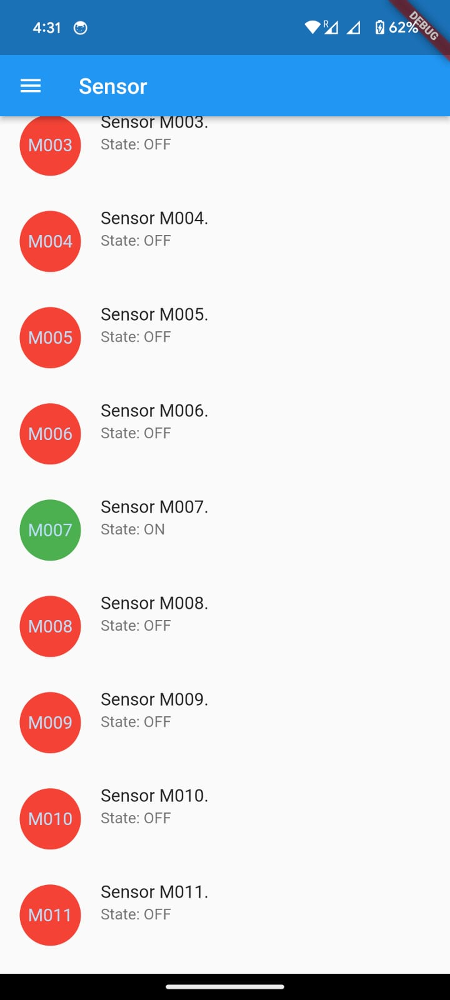
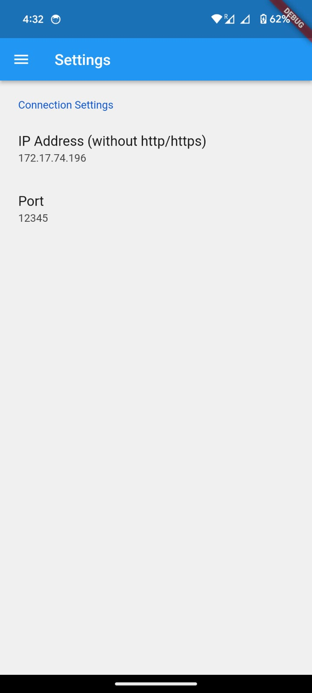

# Activity Classification & Prediction with Random Forest Classifier

## Overview

This project runs a activity classification model (Random Forest/Decision Tree) on the cloud based on sensors deployed in a house (ARUBA DATASET) and it predicts based on that.



The actual setup of the sensors are not done, so it's a simulated sensor setup that randomly takes sensor values and according to timestamps and sends to the model to classify and hence predict the activity done at that time using those virtual sensor data. 

This project serves as a proof of concept that one can predict and monitor activity over the internet through sensors while being away for tasks such as elderly care monitoring

## Table of Contents

- [Activity Classification \& Prediction with Random Forest Classifier](#activity-classification--prediction-with-random-forest-classifier)
  - [Overview](#overview)
  - [Table of Contents](#table-of-contents)
  - [Requirements](#requirements)
  - [Setup](#setup)
    - [Flask Server](#flask-server)
    - [Flutter Android App](#flutter-android-app)
  - [Usage](#usage)
  - [Screenshots](#screenshots)
  - [License](#license)

## Requirements

List all the dependencies and requirements for running the project.

## Setup

### Flask Server

1. **Install Dependencies:**
   ```bash
   pip install -r requirements.txt
   ```
   P.S. while running the code there may be some other dependency issues, that you may have to fix manually

2. **Run the Model:**
   Run RF.ipynb to generate the random_forest_model.mod

   ```bash
   python app.py
   ```
3. **Run the server**
    ```bash
   python server.py
   ```


   The Flask server will be running at `http://<IP ADDRESS>:12345`.

### Flutter Android App

1. **Install Flutter:**
   Follow the [official Flutter installation guide](https://flutter.dev/docs/get-started/install) to install Flutter on your machine.

2. **Install Packages:**
   ```bash
   flutter pub get
   ```

3. **Run the App:**
   ```bash
   flutter run
   ```
4. **Run the Following if required**

```dart
// For Launcher Icon Generation
flutter pub run flutter_launcher_icons 

// For Running App (main.dart)
dart run launcher_name:main

// For generating App Splash Logo & Branding

dart run flutter_native_splash:create

// For generating App project

flutter create --project-name activity_sensor_flutter --org com.activity . 

```


Ensure that an Android emulator or a physical device is connected.

## Usage

1. Run the server
2. Note the IP Address and Port
3. Open the app 
4. Go to Settings
5. Input the IP and Port
6. Come back to home page
7. Pull down to refresh

## Screenshots

<p align='center'>



</p>
<!-- <br> -->
<p align='center'>



</p>

## License

This project is licensed under the [MIT License](LICENSE).

